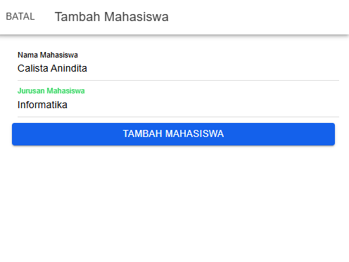
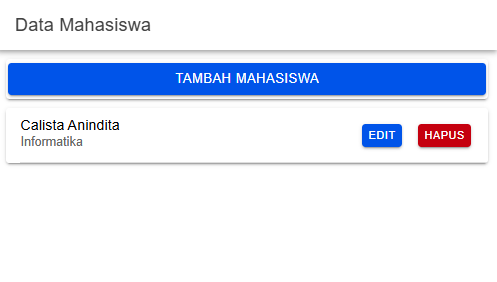
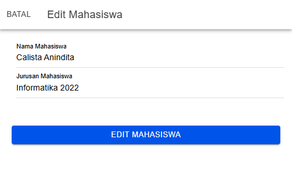
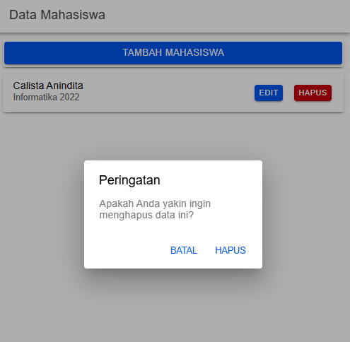
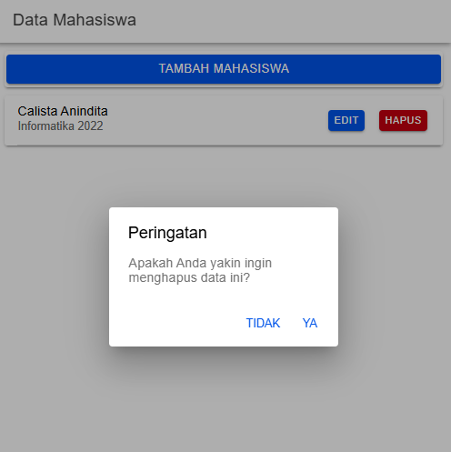

Proses CRUD Data Mahasiswa

1.  Create (Tambah Data Mahasiswa)
    
    ** openModalTambah(isOpen: boolean): sebagai modal untuk menambah data mahasiswa baru.
    ** this.modalTambah = isOpen: untuk menentukan apakah modal akan dibuka (true) atau tidak.
    ** this.resetModal(): untuk mereset atau mengosongkan semua field form modal.
    ** this.modalTambah = true: modal yang berarti modal tambah aktif.
    ** this.modalEdit = false: modal yang berarti modal edit tidak aktif
    ** tambahMahasiswa(): mengirim data mahasiswa yang baru ke server untuk disimpan.
    ** if (this.nama != '' && this.jurusan != ''): mengecek validitas form.
    ** nama: this.nama: merupakan nama yang diinputkan pada kolom nama
    ** jurusan: this.jurusan: merupakan jurusan yang diinputkan pada kolom jurusan.
    ** this.api.tambah(data, 'tambah.php'): service API untuk mengirim data ke server melalui endpoint tambah.php.
    ** resetModal(): untuk mereset data form.
    ** getMahasiswa(): untuk memuat ulang data mahasiswa terbaru.
    ** this.modal.dismiss(): untuk menutup modal. 
    ** <ion-button (click)="openModalTambah(true)" expand="block">Tambah Mahasiswa</ion-button>: tombol untuk mengatur modal tambah menjadi aktif dan mempersiapkan form untuk pengisian data baru.

2.  Read (Tampilkan Data Mahasiswa)
    
    ** ngOnInit(): untuk memuat data mahasiswa dari server ketika halaman pertama kali dibuka.
    ** getMahasiswa(): mengambil daftar mahasiswa dari server dan menampilkannya di halaman.
    ** ambilMahasiswa(id: any): mengambil data mahasiswa tertentu dari server berdasarkan id.
    ** (this.api.lihat('lihat.php?id=')): menggunakan service API untuk mengambil data mahasiswa dari server.
    ** hasil: variabel yang menyimban data mahasiswa.
    ** this.id = mahasiswa.id: data yang berisi id mahasiswa yang dapat digunakan untuk proses lebih lanjut.
    ** this.nama = mahasiswa.nama: data yang berisi nama mahasiswa yang dapat digunakan untuk proses lebih lanjut.
    ** this.jurusan = mahasiswa.jurusan: data yang berisi jurusan mahasiswa yang dapat digunakan untuk proses lebih lanjut.
    ** *ngFor="let item of dataMahasiswa": perulangan untuk menampilkan data berdasarkan array dataMahasiswa.
    ** {{ item.nama }}: menampilkan nama mahasiswa.
    ** {{ item.jurusan }}: menampilkan jurusan mahasiswa.
    ** openModalEdit(true, item.id): untuk membuka modal edit dan memuat data mahasiswa yang akan diedit.
    ** hapusMahasiswa(item.id): untuk menghapus data mahasiswa berdasarkan id.

3.  Update (Edit Data Mahasiswa)
    
    
    ** modalEdit: any: untuk menentukan apakah modal edit (pop-up form untuk mengedit data) sedang dibuka atau tidak.
    ** openModalEdit(isOpen: boolean, idget: any): membuka modal edit dengan memuat data mahasiswa yang dipilih berdasarkan ID.
    ** this.modalEdit = isOpen: mengatur modal edit agar terbuka.
    ** this.id = idget: menyimpan ID mahasiswa yang dipilih ke properti id.
    ** this.ambilMahasiswa(this.id): memanggil fungsi untuk mengambil data mahasiswa berdasarkan ID.
    ** editMahasiswa(): mengirim data yang telah diedit oleh pengguna di modal edit ke server untuk disimpan.
    ** let data: membuat objek data yang berisi ID, nama, dan jurusan.
    ** id: this.id: ID mahasiswa.
    ** nama: this.nama: nama mahasiswa (diedit dari input form).
    ** jurusan: this.jurusan: jurusan mahasiswa (diedit dari input form).
    ** this.api.edit(data, 'edit.php'): menggunakan service API untuk mengirim data ke endpoint edit.php.
    ** [isOpen]="modalEdit": modal ditampilkan jika properti modalEdit bernilai true.
    ** <ion-input label="Nama Mahasiswa" labelPlacement="floating" required [(ngModel)]="nama" placeholder="Masukkan Nama Mahasiswa" type="text"></ion-input>: mengedit nama mahasiswa.
    ** <ion-input label="Jurusan Mahasiswa" labelPlacement="floating" required [(ngModel)]="jurusan" placeholder="Masukkan Jurusan Mahasiswa" type="text"></ion-input>: mengedit jurusan mahasiswa.
    ** <ion-button type="button" (click)="editMahasiswa()" color="primary" expand="block">Edit Mahasiswa</ion-button>: tombol untuk mengirim data yang telah diedit ke server.

4.  Delete (Hapus Data Mahasiswa)
    
    
    ** hapusMahasiswa(id: any): menghapus data mahasiswa berdasarkan ID setelah mendapatkan konfirmasi dari pengguna.
    ** this.alertController.create: pop-up peringatan untuk meminta konfirmasi dari pengguna sebelum menghapus data.
    ** header: 'Peringatan': judul dialog peringatan yang berisi "Peringatan".
    ** message: 'Apakah Anda yakin ingin menghapus data ini?': pesan yang ada dalam peringatan.
    ** buttons: tombol yang menyediakan dua opsi, yaitu "Batal" dan "Hapus".
    ** this.api.hapus(id, 'hapus.php?id='): memanggil API hapus.php.
    